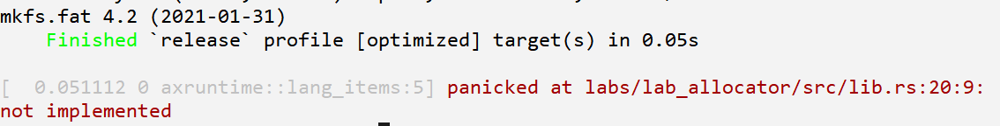
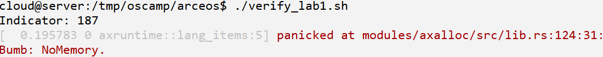

## 挑战题目1 - 针对应用场景，优化内存分配器组件

### 背景

组件化构建内核的一个优势：可以针对特定的应用场景，定制化构造内核。

目前ArceOS Unikernel有三个字节分配算法，分别是tlsf、slab和buddy，它们都是相对通用的算法。针对特定Unikernel应用，我们可以分析应用在内存申请/释放方面的规律，在保持框架不变的前提下，通过定制一个字节分配算法组件，达到较高的空间和时间分配效率。

### 题目

现在有一个应用labs/lab1（oscamp仓库切换到lab1分支可以看到它），该应用逻辑：每一轮申请一组内存块，然后间隔释放其中的一半，如此循环往复，每一轮递增一个计数（称为Indicator计数）。由于分配总是多于释放，最终系统将会内存耗尽而崩溃。崩溃时的Indicator计数越大，说明空间分配效率越高。


题目的组件构成如上图，其中标记为蓝色的字节分配器组件labs/lab_allocator也给出了实现框架，要求在其中实现字节分配算法，尽可能让Indicator计数达到最大。

**注意：只能修改字节分配器组件labs/lab_allocator，其它部分只能看不能改！**

各位参与者的成绩按照Indicator计数排名。

### 步骤

1. fork oscamp工程到个人的github帐号下

   oscamp源仓库地址：https://github.com/arceos-org/oscamp

   fork时注意，把下面的对勾去掉，否则就只有main分支

   

   注意：如果之前fork过的，看不到lab1分支，请对lab1做一下`sync fork`

2. clone 工程到本地并进入oscamp/arceos目录，切换分支到lab1，执行脚本测试环境是否正常

   ```shell
   cd oscamp/arceos/
   git switch lab1
   ./verify_lab1.sh
   ```

   执行脚本./verify_lab1.sh后，会提示lab_allocator有许多Trait未实现：

   

   <center><p>图1：lab_allocator组件实现前显示结果</p></center>

3. 修改labs/lab_allocator组件，支持自定义的字节内存分配算法，再次执行运行脚本

   目前已经给出了lab_allocator作为字节内存分配器的框架，填充实现自己的算法即可。注意：labs/lab_allocator组件是我们唯一可以修改的部分。

   组件实现后，执行脚本./verify_lab1.sh，正常时会显示如下面的输出内容：

   

   <center><p>图2：lab_allocator组件实现后显示结果</p></center>

   Indicator计数大于170是有效答案。（图中的指标187仅是示例）

   > **这个计数必须大于170，因为arceos默认的tlsf算法本身就能达到170。**

4. commit&push本地工程到github，确认提交完整和运行正常

   **务必检查确认本地的commits已经push到你在github上fork的仓库中的lab1分支。**

   在发送邮件之前，请确认项目是可以正常下载和运行的，我们的检查程序会按照如下步骤检查：

   ```shell
   git clone [你的oscamp仓库URL]
   cd oscamp/arceos
   git switch lab1
   ./verify_lab1.sh
   git diff 13a8c47 --stat --name-only
   ```

   请大家在提交邮件前，按照上述步骤在本地验证一下。主要是确认第4行输出如图2，以便检查程序能够提取Indicator值；第5行会确认只修改了lab_allocator组件。

5. 把你的工程仓库URL通过邮件发送到sun_ye@massclouds.com

   邮件题目：lab1

   邮件内容（仅包含下面两行）：

   ​	你fork的oscamp仓库URL

   ​	你的微信ID

6. 等待验证和排名

### 规则

1. **只能**修改labs/lab_allocator组件，不能修改除它之外的其它部分
2. 执行结束时的原因必须是`Bumb: No Memory.`
3. 执行结束时Indicator计数必须大于170，即**Indicator > 170**时成绩有效。
4. 优先按照执行结束时**Indicator计数排名**，计数相同按照收到邮件的时间先后顺序排名
5. 截止时间11月22日中午12点。邮件**只能发送一次**，请注意大家遵守游戏规则

### 提示

1. 需要研究labs/lab1这个应用的分配释放规律

2. 可以引入新的内存分配算法，也可以基于现有的几个内存分配算法做改进

   现有的三个算法的测试结果是：tlsf(170)，slab(92)，buddy(94)，但这只是优化前的情况，有可能默认指标低的会有更大提升潜力。

3. 由于邮件只能提交一次，请考虑提交时间的策略问题

   早提交可能失去继续优化机会；如果临到截止时间提交，有可能因为相同结果而排名落后。